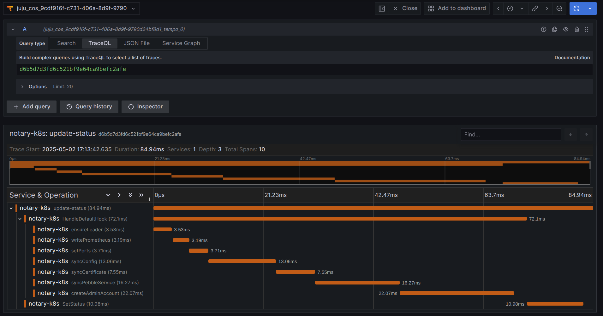

# notary-k8s-operator

This charm is a Proof of Concept for validating the [goops](https://github.com/gruyaume/goops) library. The official charm can be found [here](https://github.com/canonical/notary-k8s-operator).

The charm supports many typical charm integrations, including:
- `metrics` for Prometheus scraping
- `tracing` for OpenTelemetry
- `certificates` for TLS certificate management

The tracing integration here is especially interesting since we could use it to gather insight into performance improvements from using `goops`:

<p align="center">
  
</p>

<p align="center">
  <i>OpenTelemetry Charm Traces.</i>
</p>

## Getting Started

```shell
charmcraft pack --verbose
juju deploy ./notary-k8s_amd64.charm --trust --resource notary-image=ghcr.io/canonical/notary:0.0.3
```
